# Comprehensive UiPath Projects Manual & Step-by-Step Explanation 📘

This document provides an in-depth, project-by-project breakdown of every automation workflow contained within the **HRL X UiPath** repository. Each section covers the **objective**, **variables used**, **step-by-step execution logic**, **architecture diagrams**, and **sample outputs**.

---

## 📑 Table of Contents
1. [Auto File Organizer Bot (`AutoFileOrganizer`)](#1-auto-file-organizer-bot)
2. [Smart Notepad Greeter (`SmartNotepadGreeter`)](#2-smart-notepad-greeter)
3. [Automax Toll Booth Calculator (`AutomaxTollBoothCalculator`)](#3-automax-toll-booth-calculator)
4. [The Student Exam Evaluator (`StudentExamEvaluator`)](#4-the-student-exam-evaluator)
5. [Control Flow: If - Check Positive Number (`01_If_PositiveNumber`)](#5-control-flow-if---check-positive-number)
6. [Control Flow: If-Else - Even or Odd (`02_IfElse_EvenOdd`)](#6-control-flow-if-else---even-or-odd)
7. [Control Flow: Switch - Menu Selection (`03_Switch_MenuSelection`)](#7-control-flow-switch---menu-selection)
8. [Control Flow: For Each - Items List (`04_ForEach_ItemsList`)](#8-control-flow-for-each---items-list)
9. [Control Flow: While - Count to Five (`05_While_CountToFive`)](#9-control-flow-while---count-to-five)
10. [Control Flow: Do While - Count to Five (`06_DoWhile_CountToFive`)](#10-control-flow-do-while---count-to-five)
11. [Control Flow: Break - Premature Loop Exit (`07_Break_LoopExit`)](#11-control-flow-break---premature-loop-exit)
12. [Custom Reusable Activity Library (`BlankLibrary`)](#12-custom-reusable-activity-library)
13. [Enterprise Solution & REFramework (`Solution`)](#13-enterprise-solution--reframework)

---

## 1. Auto File Organizer Bot

* **Directory**: [`AutoFileOrganizer/`](./AutoFileOrganizer/)
* **Entry Point**: `Main.xaml`
* **Difficulty Level**: Intermediate

### Objective
To automate file classification and cleanup by scanning an unorganized download directory (`Raw Downloads/`), identifying each file's format via its extension, and routing it to the appropriate destination folder:
* **Documents (`.pdf`)** → `PDF/`
* **Images (`.jpg`, `.jpeg`, `.png`)** → `Images/`
* **Workbooks (`.xlsx`)** → `Excel/`

### Variables Dictionary
| Variable Name | Data Type | Default / Scope | Description |
|---|---|---|---|
| `rawDownloadsDir` | `String` | `"Raw Downloads"` | Path to the directory containing unsorted files |
| `pdfDir` | `String` | `"PDF"` | Target destination path for PDF documents |
| `imagesDir` | `String` | `"Images"` | Target destination path for image files |
| `excelDir` | `String` | `"Excel"` | Target destination path for Excel spreadsheets |
| `folderExists` | `Boolean` | Scope: Main | Tracks whether a specific target folder already exists |
| `currentFile` | `String` | Scope: ForEach | Full path of the file currently being processed |
| `fileExt` | `String` | Scope: ForEach | Lowercase file extension extracted from `currentFile` |

### Step-by-Step Logic Flow
1. **Directory Validation & Creation**:
   * Uses `ui:FolderExistsX` on `PDF/`, `Images/`, and `Excel/`.
   * For each missing folder, triggers `ui:CreateDirectory` to dynamically establish the directory structure.
2. **File Enumeration**:
   * Calls `Directory.GetFiles(rawDownloadsDir)` within a `ui:ForEach<String>` activity to iterate through each file in `Raw Downloads/`.
3. **Extension Parsing**:
   * Runs an `Assign` activity: `fileExt = Path.GetExtension(currentFile).ToLower()`.
4. **Conditional Routing**:
   * **Branch 1 (`If fileExt = ".pdf"`)**: Executes `ui:MoveFile` moving file to `PDF/`.
   * **Branch 2 (`If fileExt = ".jpg" Or fileExt = ".jpeg" Or fileExt = ".png"`)**: Executes `ui:MoveFile` moving file to `Images/`.
   * **Branch 3 (`If fileExt = ".xlsx"`)**: Executes `ui:MoveFile` moving file to `Excel/`.
5. **Completion Logging**:
   * Emits a `ui:LogMessage` for every moved item and outputs an execution summary.

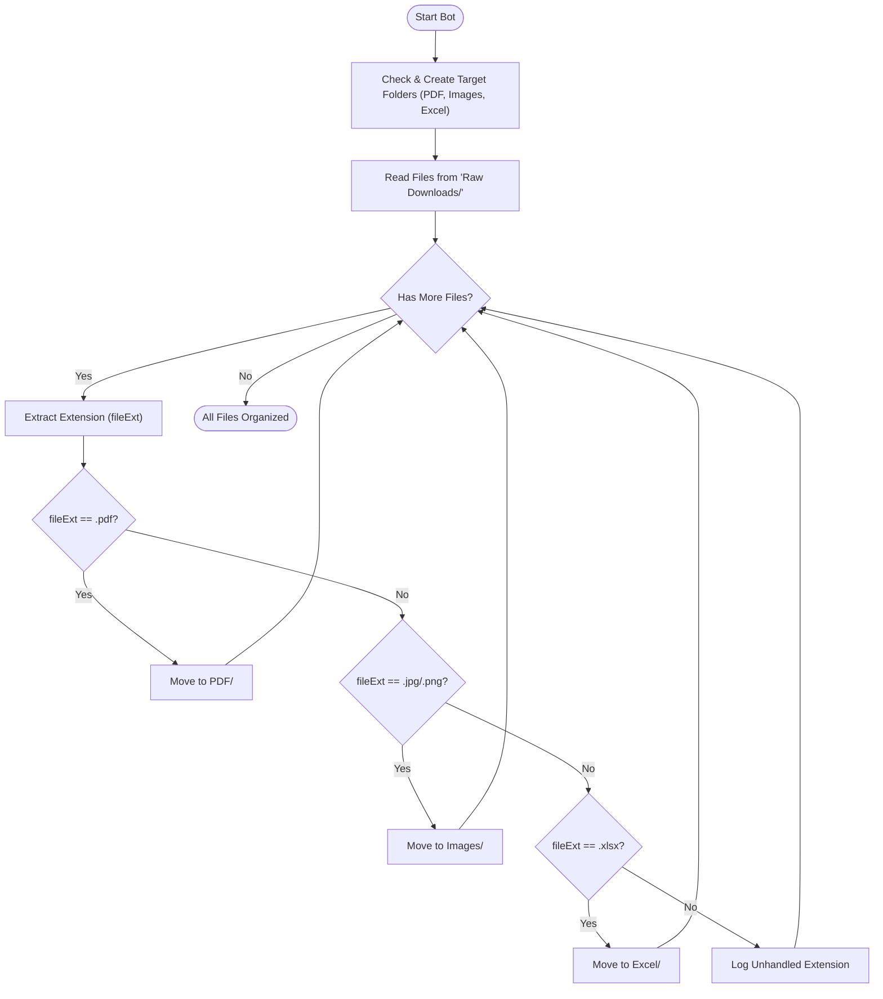

---

## 2. Smart Notepad Greeter

* **Directory**: [`SmartNotepadGreeter/`](./SmartNotepadGreeter/)
* **Entry Point**: `Main.xaml`
* **Difficulty Level**: Beginner to Intermediate

### Objective
Demonstrates desktop user interface (UI) automation with UiPath Modern Experience by collecting user credentials, classifying their age category, and typing a personalized welcome greeting into Windows Notepad.

### Variables Dictionary
| Variable Name | Data Type | Default / Scope | Description |
|---|---|---|---|
| `str_Name` | `String` | Main Sequence | Stores the user's name entered via Input Dialog |
| `int_Age` | `Int32` | Main Sequence | Stores the user's age parsed as a 32-bit integer |
| `str_Category` | `String` | Main Sequence | Stores the computed classification (`"an Adult"` or `"a Minor"`) |
| `str_Message` | `String` | Main Sequence | Formatted greeting string typed into Notepad |

### Step-by-Step Logic Flow
1. **Collect Name**: `ui:InputDialog` prompts `"Please enter your name:"` → Stores in `str_Name`.
2. **Collect Age**: `ui:InputDialog` prompts `"Please enter your age:"` → Stores in `int_Age`.
3. **Age Classification**:
   * Evaluates `int_Age >= 18` in an `If` activity.
   * **Then**: `str_Category = "an Adult"`.
   * **Else**: `str_Category = "a Minor"`.
4. **Message Formatting**:
   * Assigns:
     ```vb
     str_Message = "Hello " + str_Name + ", you are " + str_Category + "!" + vbCrLf + "Welcome to UiPath Automation."
     ```
5. **Modern Desktop UI Automation**:
   * Scopes `uix:NApplicationCard` targeting `notepad.exe`.
   * Invokes `uix:NTypeInto` to simulate typing the formatted `str_Message` directly into Notepad's document canvas.
6. **Graceful Completion**:
   * Executes a 2-second `Delay` and logs execution details via `ui:LogMessage`.

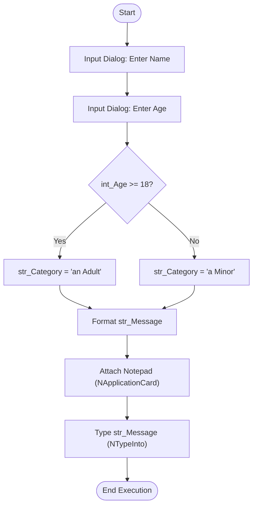

---

## 3. Automax Toll Booth Calculator

* **Directory**: [`AutomaxTollBoothCalculator/`](./AutomaxTollBoothCalculator/)
* **Entry Point**: `Main.xaml`
* **Difficulty Level**: Intermediate

### Objective
Applies string evaluation logic and control flags to compute toll booth tariffs based on vehicle type and automatically produces a formatted billing receipt in Windows Notepad.

### Variables Dictionary
| Variable Name | Data Type | Default / Scope | Description |
|---|---|---|---|
| `str_VehicleType` | `String` | Main Sequence | The type of vehicle entered (`"Car"` or `"Truck"`) |
| `int_TollFee` | `Int32` | Main Sequence | Dynamic toll charge (Rs. 100 for Truck; Rs. 50 for Car) |
| `str_Receipt` | `String` | Main Sequence | Multi-line receipt text written to Notepad |

### Step-by-Step Logic Flow
1. **Operator Input**:
   * `ui:InputDialog` asks: `"Enter vehicle type (Car / Truck):"` → Result saved to `str_VehicleType`.
2. **Case-Insensitive String Check**:
   * `If` condition: `str_VehicleType.ToLower() = "truck"`.
   * **Then Branch**: `int_TollFee = 100`.
   * **Else Branch**: `int_TollFee = 50`.
3. **Consolidate Receipt**:
   * Assigns:
     ```vb
     str_Receipt = "Vehicle: " + str_VehicleType + vbCrLf + "Total Toll Due: Rs. " + int_TollFee.ToString()
     ```
4. **Notepad Output**:
   * Automates Notepad via `uix:NApplicationCard` and types `str_Receipt` using `uix:NTypeInto`.
5. **Terminal Alert**:
   * Waits 3 seconds (`Delay Duration="00:00:03"`).
   * Displays modal `ui:MessageBox`: `"Toll Processed! Check terminal output."`.

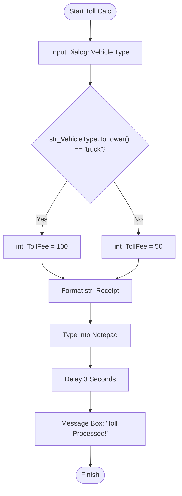

---

## 4. The Student Exam Evaluator

* **Directory**: [`StudentExamEvaluator/`](./StudentExamEvaluator/)
* **Entry Point**: `StudentExamEvaluator.xaml` *(Custom workflow name)*
* **Difficulty Level**: Advanced Basics

### Objective
Manages conditional evaluation logic coupled with intentional workflow tracking, diagnostic logging, and simulated background processing latency.

### Variables Dictionary
| Variable Name | Data Type | Default / Scope | Description |
|---|---|---|---|
| `str_StudentName` | `String` | Main Sequence | Name of the student being evaluated |
| `int_Marks` | `Int32` | Main Sequence | Exam score entered (scale 0 - 100) |
| `str_Result` | `String` | Main Sequence | Outcome status: `"PASSED"` or `"FAILED"` |

### Step-by-Step Logic Flow
1. **Input Proctoring**:
   * `ui:InputDialog`: Prompt for student name → `str_StudentName`.
   * `ui:InputDialog`: Prompt for marks scored → `int_Marks`.
2. **Diagnostic Stream**:
   * `ui:LogMessage Level="Info"`: `"Evaluating marks for " + str_StudentName`.
3. **Latency Simulation**:
   * `Delay Duration="00:00:02"` (Simulates server verification latency).
4. **Conditional Branching**:
   * `If` condition: `int_Marks >= 40`.
   * **Then**: `Assign str_Result = "PASSED"`.
   * **Else**: `Assign str_Result = "FAILED"`.
5. **Result Alert**:
   * `ui:MessageBox`:
     ```text
     Result for [str_StudentName]: [str_Result] (Score: [int_Marks]/100)
     ```
   * Emits final log entry.

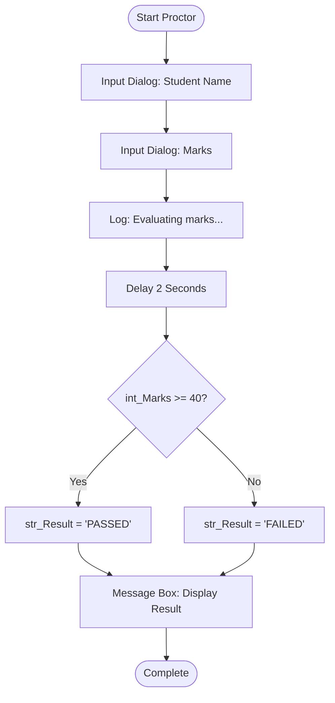

---

## 5. Control Flow: If - Check Positive Number

* **Directory**: [`ControlFlow/01_If_PositiveNumber/`](./ControlFlow/01_If_PositiveNumber/)
* **Entry Point**: `If_PositiveNumber.xaml`
* **UiPath Activity**: `If` (Single condition branch)

### Objective
Demonstrates single-branch conditional evaluation where an action is taken only if the input number satisfies $N > 0$.

### Variables & Implementation
* **Variables**: `N` (`Int32`).
* **Input**: Prompt `"Enter a Number:"` via `ui:InputDialog`.
* **Evaluation**: `[N > 0]`.
* **True Action**:
  * `ui:MessageBox`: `"Positive Number: " + N.ToString()`.
  * `ui:LogMessage`: `"User entered positive number: " + N.ToString()`.

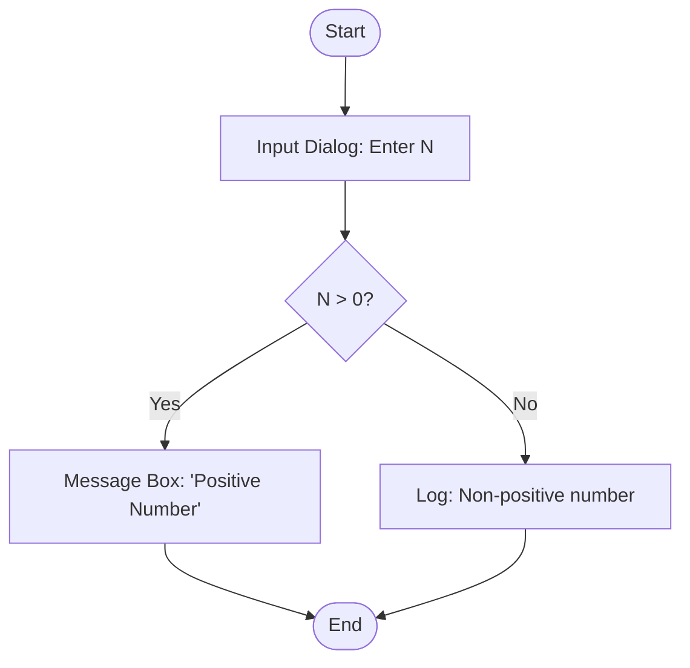

---

## 6. Control Flow: If-Else - Even or Odd

* **Directory**: [`ControlFlow/02_IfElse_EvenOdd/`](./ControlFlow/02_IfElse_EvenOdd/)
* **Entry Point**: `IfElse_EvenOdd.xaml`
* **UiPath Activity**: `If` (Binary `Then` / `Else` branching)

### Objective
Applies mathematical modulo operator (`Mod`) to classify an integer as either Even or Odd with dual-branch notifications.

### Variables & Implementation
* **Variables**: `N` (`Int32`).
* **Input**: Prompt `"Enter a Number:"` via `ui:InputDialog`.
* **Evaluation**: `[N Mod 2 = 0]`.
* **Then Branch (True)**:
  * `ui:MessageBox`: `N.ToString() + " is an Even Number"`.
* **Else Branch (False)**:
  * `ui:MessageBox`: `N.ToString() + " is an Odd Number"`.

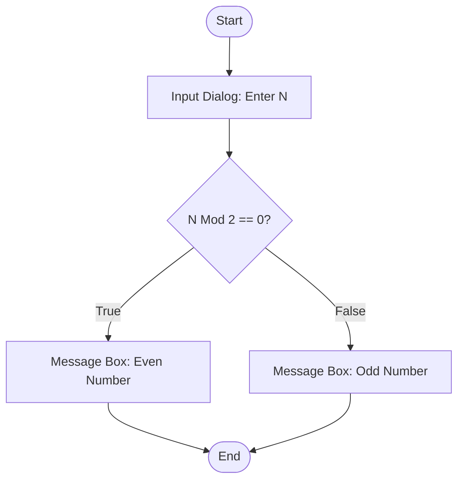

---

## 7. Control Flow: Switch - Menu Selection

* **Directory**: [`ControlFlow/03_Switch_MenuSelection/`](./ControlFlow/03_Switch_MenuSelection/)
* **Entry Point**: `Switch_MenuSelection.xaml`
* **UiPath Activity**: `Switch<Int32>` (Multi-way branch)

### Objective
Replaces complex nested `If-Else-If` structures with an optimized integer `Switch` activity to route user arithmetic choices.

### Variables & Implementation
* **Variables**: `Choice` (`Int32`).
* **Input**: `ui:InputDialog` with menu options:
  * `1`: Add
  * `2`: Subtract
  * `3`: Multiply
* **Switch Cases**:
  * `Case 1`: `ui:MessageBox`: `"Selected Operation: Addition"`.
  * `Case 2`: `ui:MessageBox`: `"Selected Operation: Subtraction"`.
  * `Case 3`: `ui:MessageBox`: `"Selected Operation: Multiplication"`.
  * `Default`: `ui:MessageBox`: `"Invalid Choice: [Choice]. Please choose 1, 2, or 3."`.

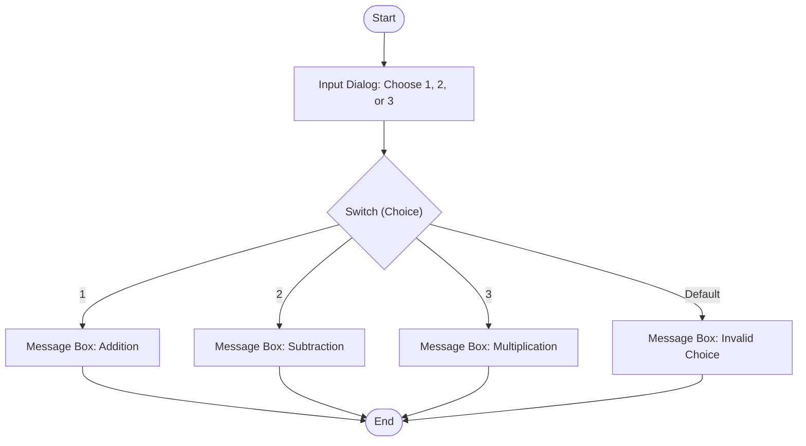

---

## 8. Control Flow: For Each - Items List

* **Directory**: [`ControlFlow/04_ForEach_ItemsList/`](./ControlFlow/04_ForEach_ItemsList/)
* **Entry Point**: `ForEach_ItemsList.xaml`
* **UiPath Activity**: `ui:ForEach<String>` (Collection enumeration)

### Objective
Demonstrates array iteration, reading elements sequentially from a collection without manually maintaining an index pointer.

### Variables & Implementation
* **Variables**: `Items` (`String[]`, Default: `{"Apple", "Banana", "Mango"}`).
* **Loop**: `ui:ForEach x:TypeArguments="x:String"` iterating over `[Items]`.
* **Body Action**:
  * Argument: `item` (`String`).
  * `ui:MessageBox`: `"Item: " + item`.
  * `ui:LogMessage`: `"Processing item: " + item`.
* **Post-Loop**: `ui:MessageBox`: `"All items in the list have been displayed!"`.

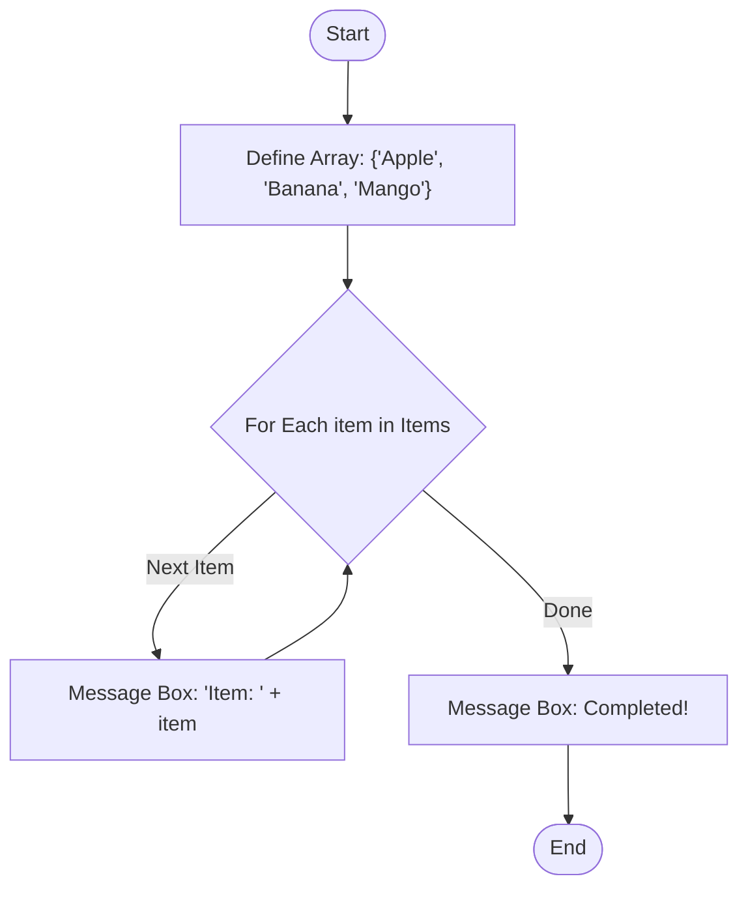

---

## 9. Control Flow: While - Count to Five

* **Directory**: [`ControlFlow/05_While_CountToFive/`](./ControlFlow/05_While_CountToFive/)
* **Entry Point**: `While_CountToFive.xaml`
* **UiPath Activity**: `ui:InterruptibleWhile` (Pre-test condition loop)

### Objective
Demonstrates pre-test loop mechanics where the condition `i <= 5` is evaluated **before** each iteration body executes.

### Variables & Implementation
* **Variables**: `i` (`Int32`, Default: `1`).
* **Condition**: `[i <= 5]`.
* **Body**:
  1. `ui:MessageBox`: `"While Loop Count: " + i.ToString()`.
  2. `ui:LogMessage`: `"While Counter = " + i.ToString()`.
  3. `Assign`: `i = i + 1`.
* **Post-Loop**: `ui:MessageBox`: `"While loop completed! Final value of i: " + i.ToString()`.

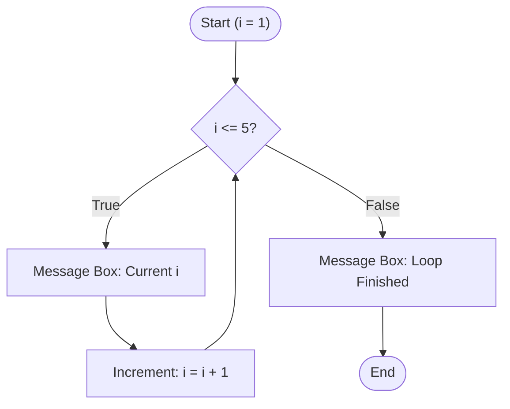

---

## 10. Control Flow: Do While - Count to Five

* **Directory**: [`ControlFlow/06_DoWhile_CountToFive/`](./ControlFlow/06_DoWhile_CountToFive/)
* **Entry Point**: `DoWhile_CountToFive.xaml`
* **UiPath Activity**: `ui:InterruptibleDoWhile` (Post-test condition loop)

### Objective
Demonstrates post-test loop mechanics: the loop body **always executes at least once** regardless of initial condition truth.

### Variables & Implementation
* **Variables**: `i` (`Int32`, Default: `1`).
* **Body (Executes First)**:
  1. `ui:MessageBox`: `"Do While Loop Count: " + i.ToString()`.
  2. `ui:LogMessage`: `"Do While Current i = " + i.ToString()`.
  3. `Assign`: `i = i + 1`.
* **Condition (Evaluated After)**: `[i <= 5]`.
* **Post-Loop**: `ui:MessageBox`: `"Do While loop completed! Final value of i: " + i.ToString()`.

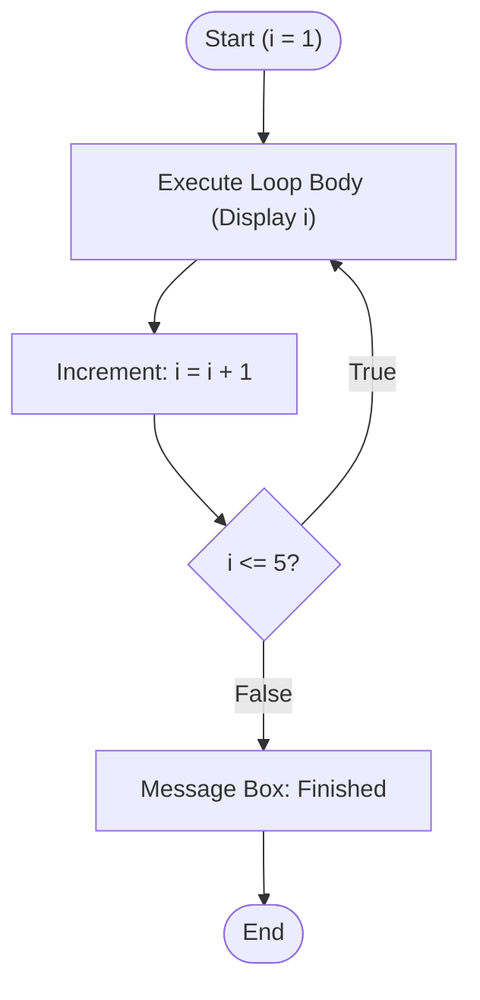

---

## 11. Control Flow: Break - Premature Loop Exit

* **Directory**: [`ControlFlow/07_Break_LoopExit/`](./ControlFlow/07_Break_LoopExit/)
* **Entry Point**: `Break_LoopExit.xaml`
* **UiPath Activity**: `ui:Break` inside `ui:InterruptibleWhile`

### Objective
Demonstrates controlled premature loop exit: search numbers from 1 to 20, but stop and break immediately upon reaching the first number greater than 10.

### Variables & Implementation
* **Variables**: `i` (`Int32`, Default: `1`).
* **Loop**: `While [i <= 20]`.
* **Body Logic**:
  1. `ui:LogMessage`: `"Checking number: " + i.ToString()`.
  2. `If` condition: `[i > 10]`:
     * **Then**:
       * `ui:MessageBox`: `"Break triggered! First number greater than 10 is: " + i.ToString()`.
       * `ui:Break` (Stops loop execution immediately).
     * **Else**: Continues.
  3. `Assign`: `i = i + 1`.
* **Post-Loop**: `ui:MessageBox`: `"Loop successfully terminated. Found number: " + i.ToString()`.

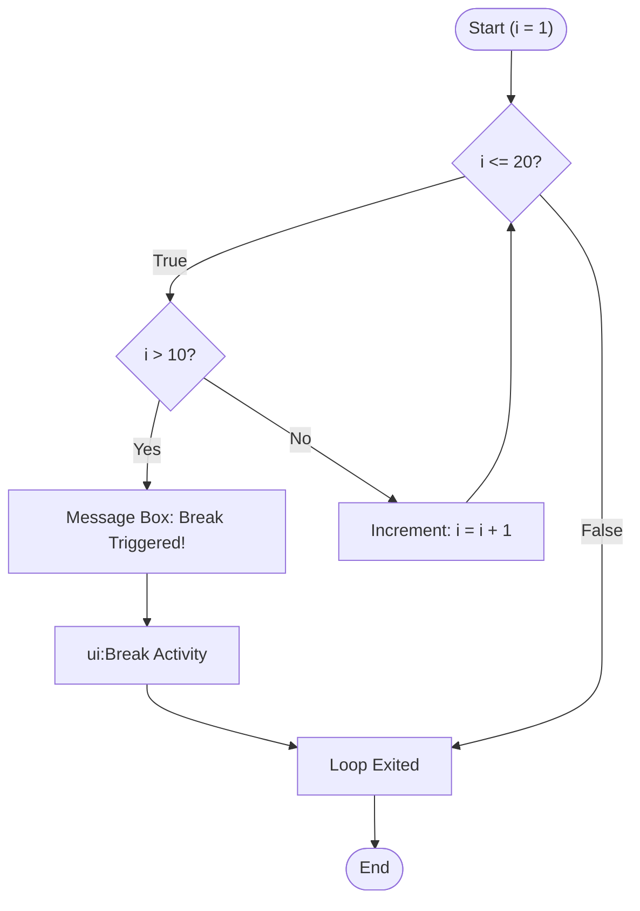

---

## 12. Custom Reusable Activity Library

* **Directory**: [`BlankLibrary/`](./BlankLibrary/)
* **Entry Point**: `NewActivity.xaml`
* **Type**: UiPath Activity Package (`.nupkg`)

### Objective
Encapsulates reusable custom business logic and workflows into compiled NuGet activity packages that can be published to enterprise feeds and referenced across multiple business automation projects.

### Architecture & Capabilities
* Packaged as a standard UiPath Activity Library.
* Exposes parameterized in/out arguments.
* Integrates with UiPath Object Repository and Data Fabric entity stores.

---

## 13. Enterprise Solution & REFramework

* **Directory**: [`Solution/`](./Solution/)
* **Key Assets**: `Solution.uipx` & `RoboticEnterpriseFramework/`
* **Architecture**: Transactional Finite State Machine (FSM)

### Objective
Implements UiPath's flagship enterprise framework for high-volume, mission-critical, unattended automations requiring enterprise logging, credential management, and robust exception recovery.

### The 4 REFramework States
1. **Initial State (Init)**:
   * Reads settings, assets, and constants from `Data/Config.xlsx`.
   * Initializes application environments (browsers, desktop apps).
   * Verifies required system credentials.
2. **Get Transaction Data**:
   * Retrieves the next transaction item from an Orchestrator Queue, database, or tabular dataset.
   * Checks if more items exist; transitions to **End Process** if empty.
3. **Process Transaction**:
   * Executes business logic for the specific transaction item.
   * Catches `BusinessRuleException` (invalid business data) vs `SystemException` (crashes/network timeouts).
   * Updates transaction status via `SetTransactionStatus.xaml`.
4. **End Process**:
   * Gracefully closes all opened applications (`CloseAllApplications.xaml`).
   * If closing fails, forces process cleanup (`KillAllProcesses.xaml`).

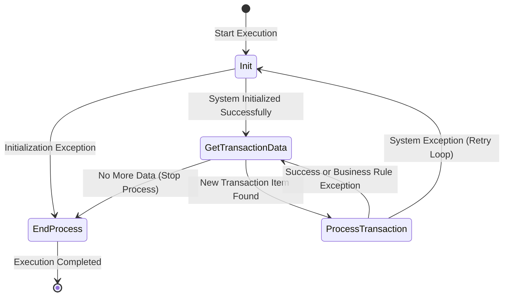

---

## 💡 Summary Comparison Table

| # | Project Name | Entry Point | Core Technique | Complexity |
|---|---|---|---|---|
| **1** | Auto File Organizer | `Main.xaml` | File I/O, Directory Parsing | Intermediate |
| **2** | Smart Notepad Greeter | `Main.xaml` | Desktop UI Automation | Beginner |
| **3** | Automax Toll Booth | `Main.xaml` | String Evaluation, Math logic | Intermediate |
| **4** | Student Exam Evaluator | `StudentExamEvaluator.xaml` | Proctor Logging, Conditionals | Advanced Basics |
| **5** | 01 - If Positive | `If_PositiveNumber.xaml` | Single Branch Condition | Beginner |
| **6** | 02 - If Else Even/Odd | `IfElse_EvenOdd.xaml` | Modulo Arithmetic (`Mod`) | Beginner |
| **7** | 03 - Switch Menu | `Switch_MenuSelection.xaml` | Integer `Switch<Int32>` | Beginner |
| **8** | 04 - For Each Items | `ForEach_ItemsList.xaml` | Collection Traversal (`Array`) | Beginner |
| **9** | 05 - While Count 5 | `While_CountToFive.xaml` | Pre-condition Loop | Beginner |
| **10** | 06 - Do While Count 5 | `DoWhile_CountToFive.xaml` | Post-condition Loop | Beginner |
| **11** | 07 - Break Loop Exit | `Break_LoopExit.xaml` | Premature Loop Break (`ui:Break`) | Beginner |
| **12** | BlankLibrary | `NewActivity.xaml` | Modular Component Library | Enterprise |
| **13** | REFramework Solution | `Main.xaml` / `.uipx` | Transactional State Machine | Enterprise |
